# 🔥 Tinder Analysis
Analysis on a complex dataset of 1200+ tinder profile data.

## Phase 1: Basic Analysis (EDA) ✅
### 🧰 Skills demonstrated
- Python json data flattening
- MySQL modeling
- MySQL & Python data cleaning
- R data wrangling
- R exploratory data analysis
- Tableau data visualisation
### ⤵️ Project flowchart
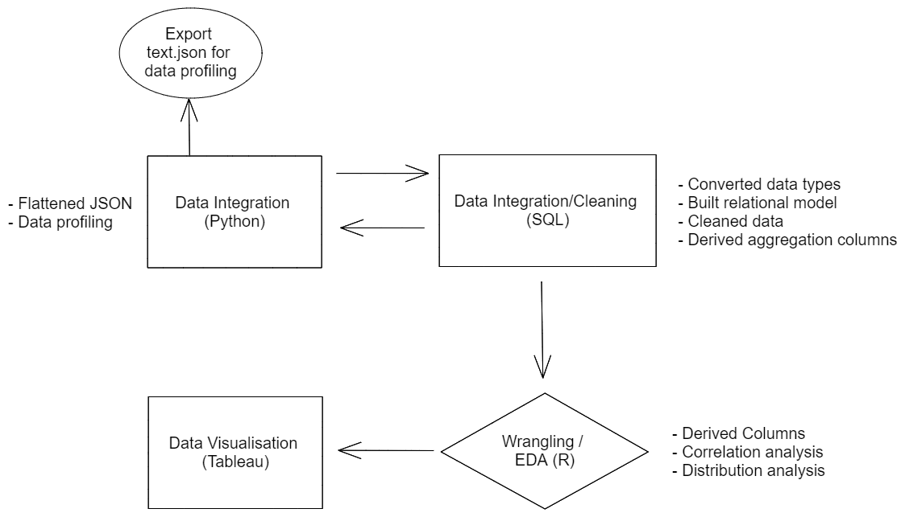
### 📘 Data model
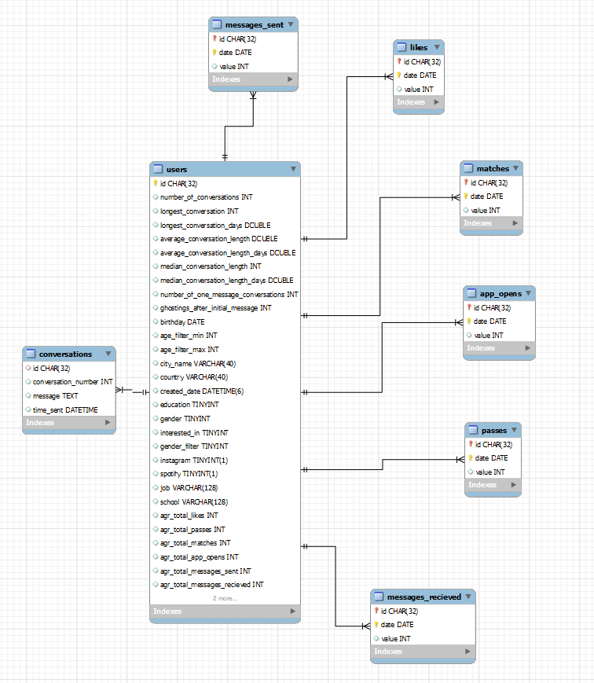
### 📈 Visualisation

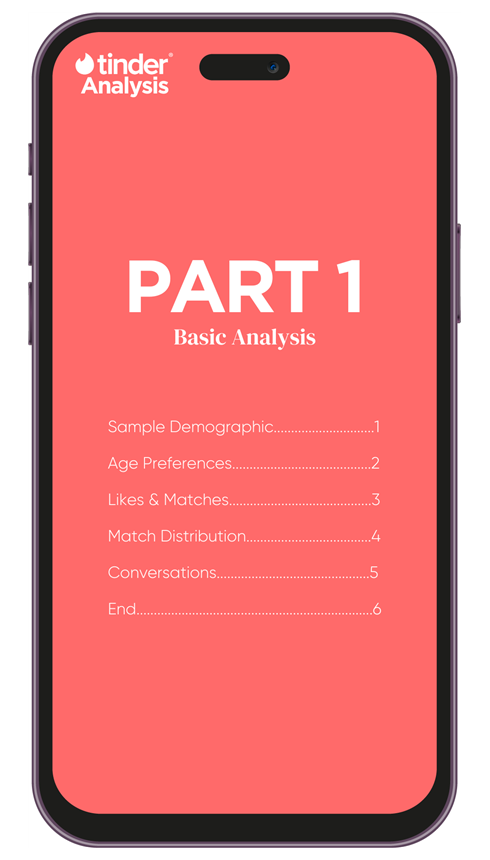
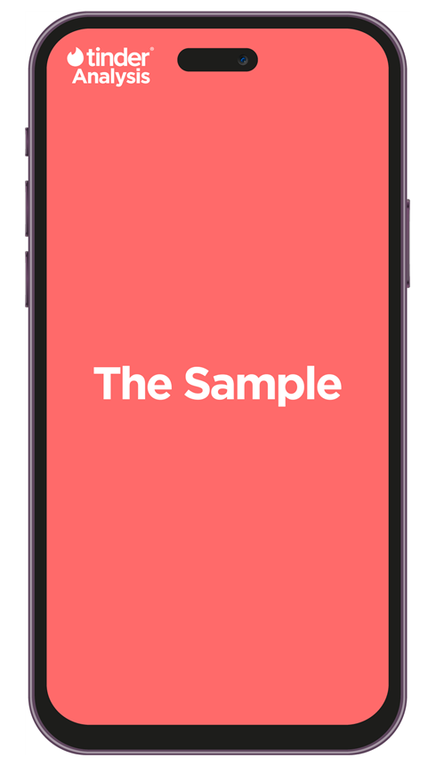

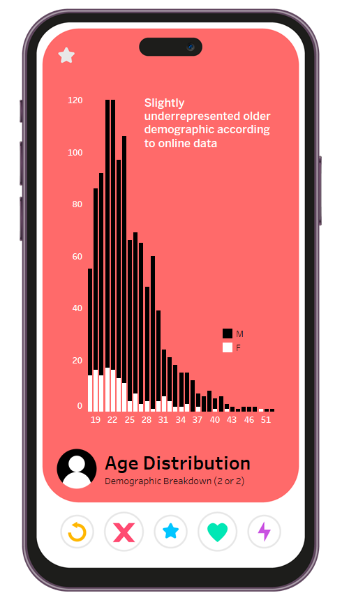
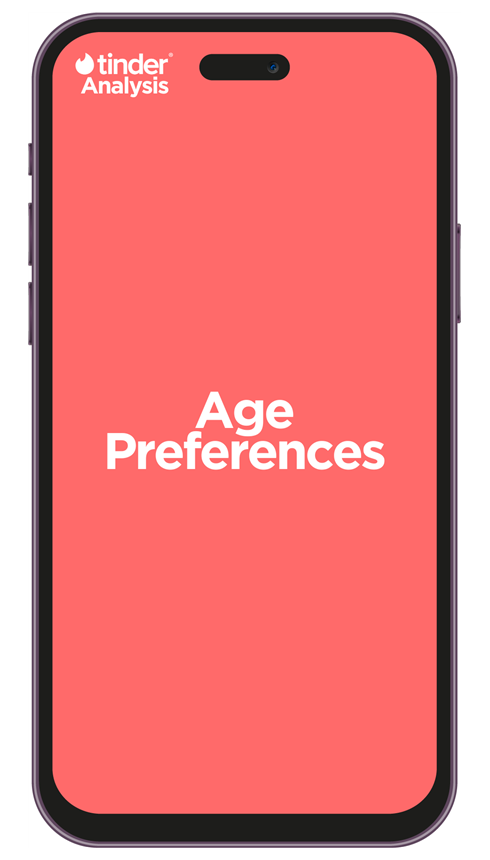
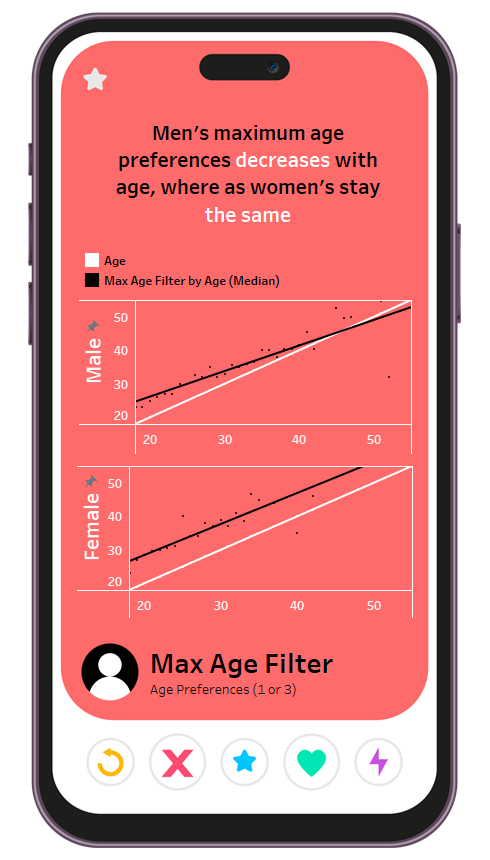

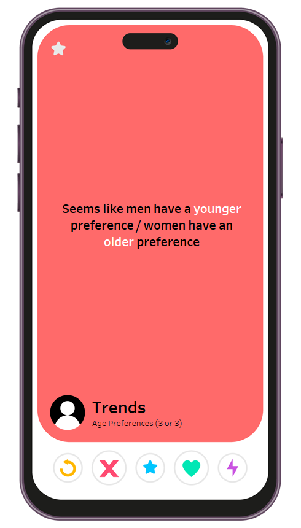

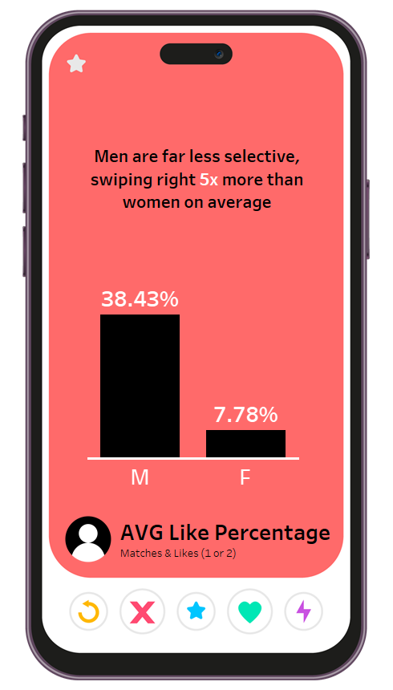
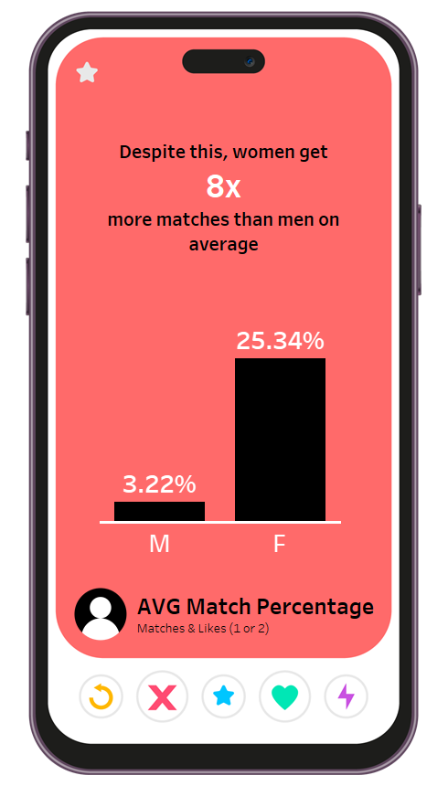
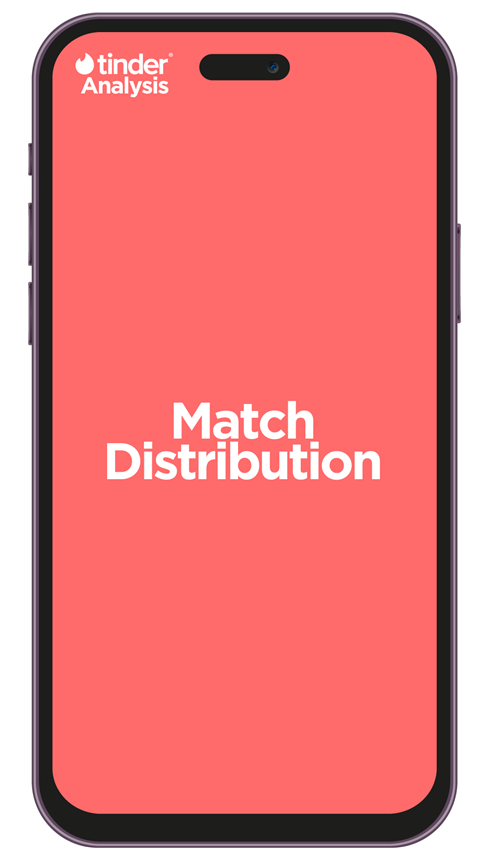

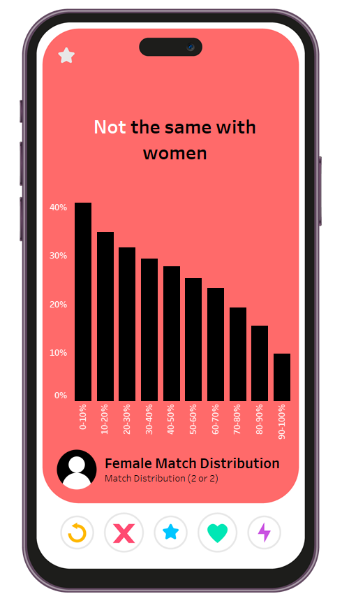

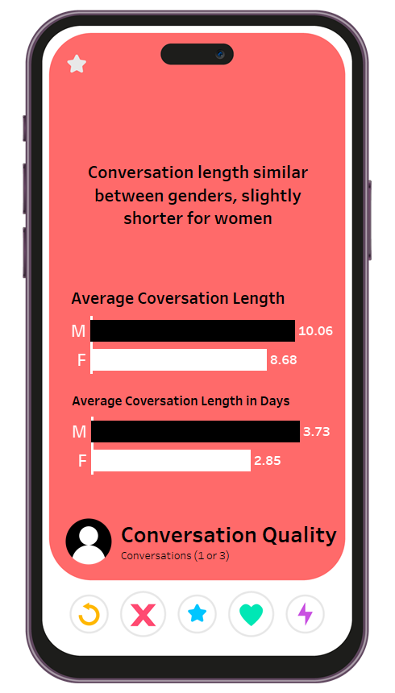
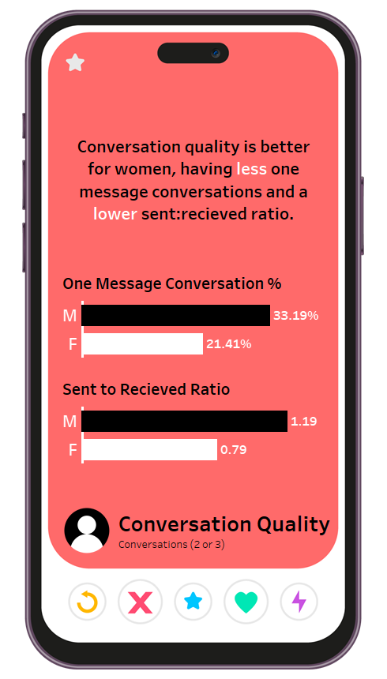
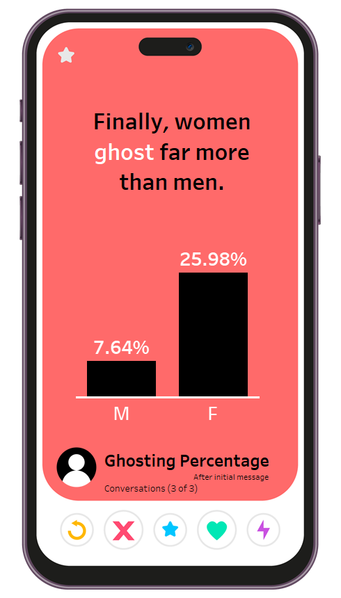

## Phase 2: Conversation Analysis (NLP)

TBC

## Phase 3: Advanced Analysis (ML)

TBC

## 💟 Data from swipestats.io
